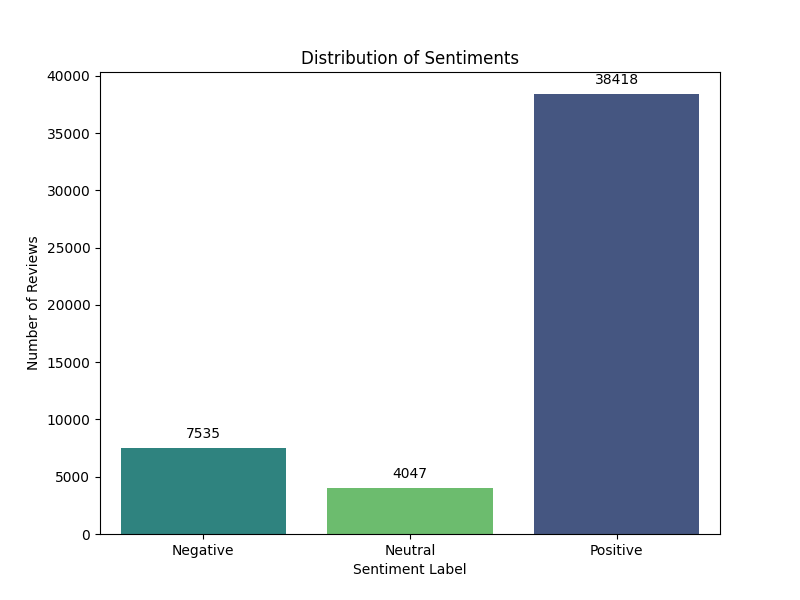
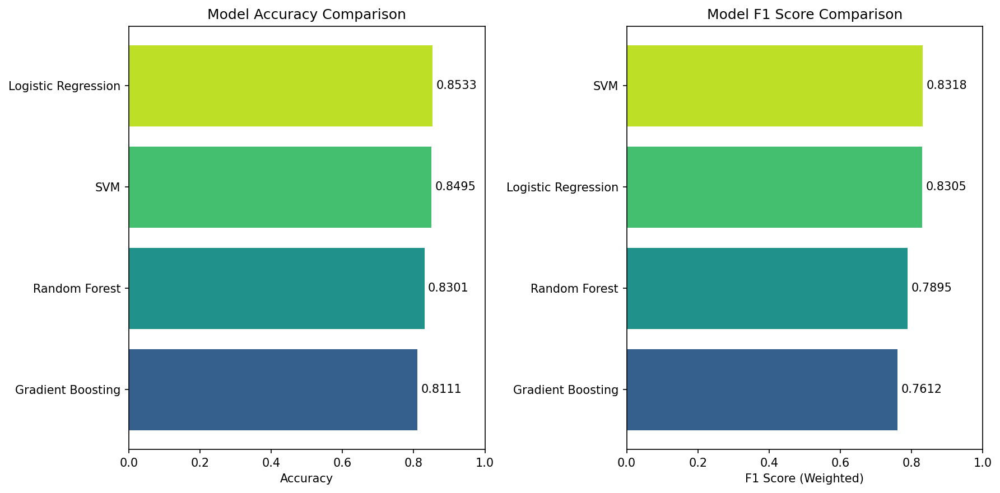
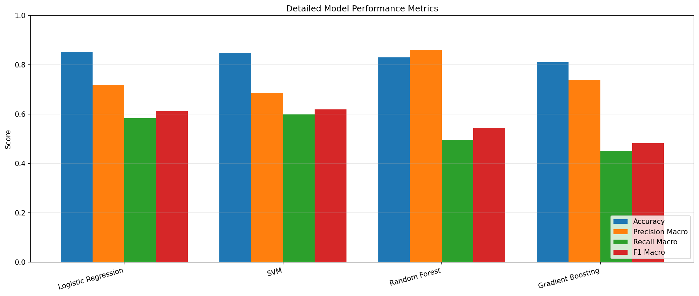

# SentiMind: Sentiment Analysis on Amazon Fine Food Reviews

A comprehensive NLP project for sentiment classification using the Amazon Fine Food Reviews dataset. This project preprocesses real-world review text, extracts meaningful features using multiple techniques, and prepares data for machine learning models.



## 📋 Project Overview

The goal of this project is to analyze customer reviews and classify them into three sentiment categories:
- **Positive** (Score 4-5)
- **Negative** (Score 1-2)
- **Neutral** (Score 3)

## 📁 Repository Structure

```
WiDS_2025/
├── README.md                    # Project documentation
├── Reviews.csv                  # Original dataset (Amazon Fine Food Reviews)
├── preprocessing.py             # Data cleaning and preprocessing
├── feature_extraction.py        # Feature extraction techniques
├── model_building.py            # Model training and evaluation
├── WIDS_2025_SentiMind.ipynb   # Jupyter notebook for exploration
├── nlp-env/                     # Python virtual environment
└── outputs/                     # Generated outputs
    ├── cleaned_data.csv         # Preprocessed text data
    ├── sentiment_distribution.png
    ├── X_train_bow.npz          # Bag-of-Words features (train)
    ├── X_test_bow.npz           # Bag-of-Words features (test)
    ├── X_train_tfidf.npz        # TF-IDF features (train)
    ├── X_test_tfidf.npz         # TF-IDF features (test)
    ├── X_train_word2vec.npy     # Word2Vec embeddings (train)
    ├── X_test_word2vec.npy      # Word2Vec embeddings (test)
    ├── y_train.npy              # Training labels
    ├── y_test.npy               # Test labels
    ├── bow_vectorizer.pkl       # Trained BoW vectorizer
    ├── tfidf_vectorizer.pkl     # Trained TF-IDF vectorizer
    ├── word2vec_model.bin       # Trained Word2Vec model
    ├── model_*.pkl              # Trained classification models
    ├── model_comparison.png     # Model accuracy comparison
    ├── detailed_metrics.png     # Detailed metrics comparison
    ├── confusion_matrix_*.png   # Confusion matrices for each model
    ├── model_performance.csv    # Performance metrics table
    └── model_metrics.json       # Metrics in JSON format
```

## 📊 Dataset

**Source:** [Amazon Fine Food Reviews - Kaggle](https://www.kaggle.com/datasets/snap/amazon-fine-food-reviews)

The dataset contains reviews of fine foods from Amazon spanning over 10 years. For this project, we use a subset of 50,000 reviews.

### Class Distribution

| Sentiment | Count | Percentage |
|-----------|-------|------------|
| Positive  | 38,418 | 76.8% |
| Negative  | 7,535  | 15.1% |
| Neutral   | 4,047  | 8.1% |

## 🔧 Data Preprocessing

The `preprocessing.py` module performs the following steps:

1. **Load Data** - Read the CSV file and handle missing values
2. **Sentiment Labeling** - Map review scores to sentiment categories
3. **Text Cleaning:**
   - Convert to lowercase
   - Remove HTML tags
   - Remove URLs
   - Remove punctuation and special characters
   - Remove numbers
   - Remove extra whitespace
   - Remove stopwords
   - Filter short words (length > 1)
   - Apply stemming (Snowball Stemmer)
4. **Visualization** - Generate sentiment distribution plot
5. **Save Cleaned Data** - Export to `outputs/cleaned_data.csv`

### Sample Text Transformation

**Original:**
> "I have bought several of the Vitality canned dog food products and have found them all to be of good quality."

**Cleaned:**
> "bought sever vital can dog food product found good qualiti product look like stew process meat smell better labrador finicki appreci product better"

## 🎯 Feature Extraction

The `feature_extraction.py` module implements three feature extraction techniques:

### 1. Bag-of-Words (BoW)

Creates a vocabulary of unique words and represents each document as a vector of word counts.

- **Vocabulary Size:** 5,000 features
- **N-grams:** Unigrams and Bigrams (1,2)
- **Filtering:** min_df=2, max_df=0.95

```python
from sklearn.feature_extraction.text import CountVectorizer

bow_vectorizer = CountVectorizer(
    max_features=5000,
    ngram_range=(1, 2),
    min_df=2,
    max_df=0.95
)
```

### 2. TF-IDF (Term Frequency-Inverse Document Frequency)

Weighs words by their importance - common words get lower weights, rare words get higher weights.

- **Vocabulary Size:** 5,000 features
- **N-grams:** Unigrams and Bigrams (1,2)
- **Sublinear TF:** Enabled (1 + log(tf))

```python
from sklearn.feature_extraction.text import TfidfVectorizer

tfidf_vectorizer = TfidfVectorizer(
    max_features=5000,
    ngram_range=(1, 2),
    min_df=2,
    max_df=0.95,
    sublinear_tf=True
)
```

### 3. Word2Vec Embeddings

Learns dense vector representations where semantically similar words have similar vectors. Document vectors are created by averaging word vectors.

- **Vector Dimensionality:** 100
- **Context Window:** 5
- **Vocabulary Size:** ~19,000 words
- **Training Epochs:** 10

```python
from gensim.models import Word2Vec

w2v_model = Word2Vec(
    sentences=tokenized_texts,
    vector_size=100,
    window=5,
    min_count=2,
    workers=4,
    epochs=10
)
```

**Sample Word Similarities:**
| Word | Similar Words |
|------|---------------|
| good | great (0.71), decent (0.65), bad (0.60), excel (0.59) |

## 🚀 Getting Started

### Prerequisites

- Python 3.10+
- Virtual environment (recommended)

### Installation

1. **Clone the repository:**
   ```bash
   git clone <repository-url>
   cd WiDS_2025
   ```

2. **Create and activate virtual environment:**
   ```bash
   python -m venv nlp-env
   source nlp-env/bin/activate  # Linux/Mac
   # or
   nlp-env\Scripts\activate     # Windows
   ```

3. **Install dependencies:**
   ```bash
   pip install pandas numpy matplotlib seaborn scikit-learn nltk gensim scipy
   ```

4. **Download NLTK data:**
   ```python
   import nltk
   nltk.download('stopwords')
   ```

### Running the Pipeline

```bash
# Step 1: Data Preprocessing
python preprocessing.py

# Step 2: Feature Extraction
python feature_extraction.py

# Step 3: Model Building & Evaluation
python model_building.py
```

## 📈 Output Files

### Data Files

| File | Description | Shape |
|------|-------------|-------|
| `cleaned_data.csv` | Preprocessed reviews with sentiments | 50,000 × 2 |
| `y_train.npy` | Training labels | 40,000 |
| `y_test.npy` | Test labels | 10,000 |

### Feature Matrices

| Feature Type | Train Shape | Test Shape | Format |
|--------------|-------------|------------|--------|
| Bag-of-Words | 40,000 × 5,000 | 10,000 × 5,000 | Sparse (npz) |
| TF-IDF | 40,000 × 5,000 | 10,000 × 5,000 | Sparse (npz) |
| Word2Vec | 40,000 × 100 | 10,000 × 100 | Dense (npy) |

### Saved Models/Vectorizers

| File | Description |
|------|-------------|
| `bow_vectorizer.pkl` | Fitted CountVectorizer for BoW |
| `tfidf_vectorizer.pkl` | Fitted TfidfVectorizer |
| `word2vec_model.bin` | Trained Word2Vec model |

### Trained Classification Models

| File | Description |
|------|-------------|
| `model_logistic_regression.pkl` | Trained Logistic Regression model |
| `model_svm.pkl` | Trained SVM (LinearSVC) model |
| `model_random_forest.pkl` | Trained Random Forest model |
| `model_gradient_boosting.pkl` | Trained Gradient Boosting model |
| `model_performance.csv` | Performance metrics comparison |
| `model_metrics.json` | Detailed metrics in JSON format |

## 🤖 Model Building

The `model_building.py` module trains and evaluates four classification models using TF-IDF features:

### Models Implemented

1. **Logistic Regression** - Fast, interpretable linear classifier
2. **SVM (LinearSVC)** - Support Vector Machine optimized for text
3. **Random Forest** - Ensemble of decision trees
4. **Gradient Boosting** - Sequential ensemble with boosting

### Model Performance

| Model | Accuracy | F1 (Macro) | F1 (Weighted) |
|-------|----------|------------|---------------|
| **Logistic Regression** | **85.33%** | 0.613 | 0.830 |
| SVM | 84.95% | 0.620 | 0.832 |
| Random Forest | 83.01% | 0.544 | 0.789 |
| Gradient Boosting | 81.11% | 0.482 | 0.761 |

**Best Model:** Logistic Regression with 85.33% accuracy

### Classification Report (Logistic Regression)

| Class | Precision | Recall | F1-Score | Support |
|-------|-----------|--------|----------|---------|
| Negative | 0.74 | 0.63 | 0.68 | 1,507 |
| Neutral | 0.54 | 0.15 | 0.23 | 809 |
| Positive | 0.88 | 0.97 | 0.92 | 7,684 |

## 📊 Visualizations

### Sentiment Distribution


The dataset shows a significant class imbalance with positive reviews dominating (~77%).

### Model Comparison


### Detailed Metrics


### Confusion Matrix (Logistic Regression)


## 🔄 Loading Saved Features

```python
import numpy as np
from scipy import sparse
import pickle

# Load TF-IDF features
X_train_tfidf = sparse.load_npz('outputs/X_train_tfidf.npz')
X_test_tfidf = sparse.load_npz('outputs/X_test_tfidf.npz')

# Load Word2Vec features
X_train_w2v = np.load('outputs/X_train_word2vec.npy')
X_test_w2v = np.load('outputs/X_test_word2vec.npy')

# Load labels
y_train = np.load('outputs/y_train.npy', allow_pickle=True)
y_test = np.load('outputs/y_test.npy', allow_pickle=True)

# Load vectorizers
with open('outputs/tfidf_vectorizer.pkl', 'rb') as f:
    tfidf_vectorizer = pickle.load(f)
```

## 🛠️ Dependencies

| Package | Version | Purpose |
|---------|---------|---------|
| pandas | 2.3+ | Data manipulation |
| numpy | 2.4+ | Numerical operations |
| matplotlib | 3.10+ | Plotting |
| seaborn | 0.13+ | Statistical visualization |
| scikit-learn | 1.8+ | ML utilities & vectorizers |
| nltk | 3.9+ | NLP preprocessing |
| gensim | 4.4+ | Word2Vec embeddings |
| scipy | 1.16+ | Sparse matrix operations |

## 👤 Author

24B0981, Divyaansh Narkhede

---

*This project demonstrates a complete NLP pipeline for sentiment analysis: from data preprocessing and feature extraction to model training and evaluation.*
